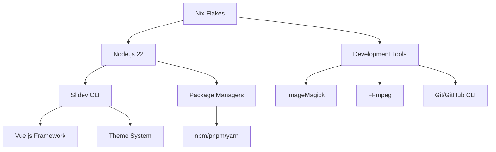

# Slidev Presentations Environment

**Modern presentation development environment powered by Nix and Slidev**

このリポジトリは[Slidev](https://sli.dev)を使用したプレゼンテーション管理とNix Flakesによる統合開発環境です。

[](https://nixos.org/)
[](https://sli.dev/)
[](https://nodejs.org/)

## 📋 目次

- [🚀 クイックスタート](#-クイックスタート)
- [🏗️ アーキテクチャ](#️-アーキテクチャ) 
- [📖 ユーザーガイド](#-ユーザーガイド)
- [🎨 テーマとカスタマイズ](#-テーマとカスタマイズ)
- [🔧 トラブルシューティング](#-トラブルシューティング)
- [📚 詳細ドキュメント](#-詳細ドキュメント)

## 🚀 クイックスタート

### 前提条件

- **Nix** (with flakes enabled)
- **direnv** (推奨)
- **Git**

### 1分セットアップ

```bash
# 1. 自動環境構築
direnv allow

# 2. 新しいプレゼンテーション作成  
nix run .#new -- my-presentation

# 3. 開発開始
cd my-presentation && npm run dev
```

### 基本コマンド

| コマンド | 説明 |
|---------|------|
| `nix run .#new -- <name>` | 新しいプレゼンテーション作成 |
| `npm run dev` | 開発サーバー起動 (localhost:3030) |
| `npm run build` | 本番ビルド |
| `npm run export` | PDF/PNG出力 |
| `nix develop` | 開発環境に入る |

## 🏗️ アーキテクチャ

### プロジェクト構造

```
slides/
├── 📄 flake.nix                   # Nix開発環境定義
├── 📄 .envrc                      # direnv自動化
├── 📄 README.md                   # このファイル
├── 📁 docs/                       # 詳細ドキュメント
│   ├── 📄 USER_GUIDE.md          # ユーザーガイド
│   ├── 📄 TROUBLESHOOTING.md     # トラブルシューティング
│   └── 📄 BEST_PRACTICES.md      # ベストプラクティス
├── 📁 templates/                  # プレゼンテーションテンプレート
├── 📁 dotfiles-overview/          # サンプルプレゼンテーション
│   ├── 📄 slides.md              # メインコンテンツ
│   ├── 📄 .envrc                 # 自動環境設定
│   └── 📄 package.json           # 依存関係
└── 📁 <your-presentation>/        # あなたのプレゼンテーション
```

### 技術スタック



### 環境の特徴

- **🔄 再現性**: Nix Flakesによる完全な環境固定
- **⚡ 高速**: 自動キャッシュとパッケージ並列取得
- **🌍 クロスプラットフォーム**: macOS/Linux対応
- **🎨 統合**: dotfiles管理システムと連携
- **🔧 拡張性**: 簡単なカスタマイズとテーマ追加

## 📖 ユーザーガイド

### プレゼンテーション作成ワークフロー

1. **プロジェクト作成**
   ```bash
   nix run .#new -- my-awesome-talk
   cd my-awesome-talk
   ```

2. **環境セットアップ**
   ```bash
   direnv allow  # 自動でNix環境を構築
   ```

3. **コンテンツ編集**
   ```bash
   # エディタでslides.mdを編集
   nvim slides.md  # または code slides.md
   ```

4. **ライブプレビュー**
   ```bash
   npm run dev
   # ブラウザで http://localhost:3030 を開く
   ```

5. **出力・公開**
   ```bash
   npm run export                    # PDF出力
   npm run build                     # 静的サイト生成
   npx surge ./dist my-talk.surge.sh # デプロイ例
   ```

### Markdownシンタックス

```markdown
---
theme: seriph
background: https://source.unsplash.com/1920x1080/?technology
title: My Presentation
---

# タイトルスライド

サブタイトル

---

# 内容スライド

- 箇条書き
- **太字**
- `コード`

```javascript
// コードブロック
console.log('Hello Slidev!')
```

<v-click>

アニメーション表示

</v-click>
```

## 🎨 テーマとカスタマイズ

### 利用可能なテーマ

| テーマ名 | 特徴 | 用途 |
|---------|------|------|
| `default` | シンプル、汎用的 | 一般的なプレゼン |
| `seriph` | モダン、ダーク | 技術系発表 |
| `apple-basic` | Apple風、ミニマル | デザイン重視 |
| `bricks` | カラフル、動的 | クリエイティブ |
| `academic` | 学術的、フォーマル | 論文発表 |

### テーマインストール

```bash
# テーマをインストール
npm install @slidev/theme-seriph

# slides.mdで指定
---
theme: seriph
---
```

### カスタマイズ例

```markdown
---
theme: seriph
colorSchema: dark
highlighter: shiki
lineNumbers: true
drawings:
  enabled: true
  persist: false
transition: slide-left
---
```

## 🔧 トラブルシューティング

### よくある問題

**Q: `direnv: error ...` が表示される**
```bash
# direnvを許可
direnv allow

# Nixを再インストール
curl -L https://nixos.org/nix/install | sh
```

**Q: `npm ERR!` パッケージエラー**
```bash
# パッケージを削除して再インストール
rm -rf node_modules package-lock.json
npm install
```

**Q: PDF出力でPlaywright エラー**
```bash
# Playwright Chromiumをインストール
npm install -D playwright-chromium
```

**Q: テーマが見つからない**
```bash
# テーマを明示的にインストール
npm install @slidev/theme-<theme-name>
```

### デバッグコマンド

```bash
# 環境確認
nix flake check                    # Flake設定確認
node --version && npm --version    # Node.js環境確認
npx slidev --version              # Slidev確認

# 詳細ログ
DEBUG=slidev* npm run dev         # 詳細デバッグ情報
```

## 📚 詳細ドキュメント

- 📖 [USER_GUIDE.md](docs/USER_GUIDE.md) - 詳細なユーザーガイド
- 🔧 [TROUBLESHOOTING.md](docs/TROUBLESHOOTING.md) - トラブルシューティング
- ✨ [BEST_PRACTICES.md](docs/BEST_PRACTICES.md) - ベストプラクティス
- 🎨 [TEMPLATES.md](docs/TEMPLATES.md) - テンプレートガイド

## 🌟 サンプルプレゼンテーション

### dotfiles-overview

現在のdotfiles管理システムを紹介する包括的なプレゼンテーション

- **スライド数**: 12枚
- **テーマ**: Seriph (ダーク)
- **内容**: Nix、マルチプラットフォーム、セキュリティ、自動化
- **PDF**: [dotfiles-overview.pdf](dotfiles-overview/dotfiles-overview.pdf)

```bash
cd dotfiles-overview
npm run dev  # プレビュー
```

## 🔗 関連リンク

### 公式ドキュメント
- [Slidev公式サイト](https://sli.dev)
- [Slidevガイド](https://sli.dev/guide/)
- [テーマギャラリー](https://sli.dev/themes/gallery.html)
- [Nix Flakes](https://nixos.wiki/wiki/Flakes)

### dotfiles関連
- [メインdotfilesリポジトリ](https://github.com/gapul/dotfiles)
- [Nix-darwin設定](../nix/platforms/darwin/)
- [開発環境ガイド](../docs/DEVELOPMENT_ENVIRONMENT_GUIDE.md)

---

## 📄 ライセンス

このプロジェクトはMITライセンスの下で公開されています。

## 🤝 コントリビューション

問題報告や改善提案は[Issues](https://github.com/gapul/dotfiles/issues)まで。

---

*🤖 Generated with [Claude Code](https://claude.ai/code)*