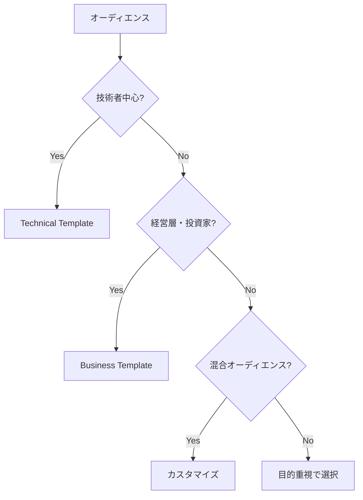
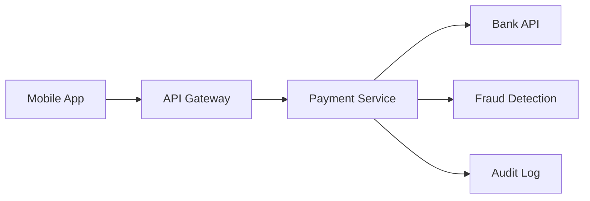

# Slidev Templates Guide

**プレゼンテーションテンプレート活用ガイド**

## 📋 目次

- [利用可能なテンプレート](#利用可能なテンプレート)
- [テンプレートの選び方](#テンプレートの選び方)
- [カスタマイズ方法](#カスタマイズ方法)
- [独自テンプレート作成](#独自テンプレート作成)

## 利用可能なテンプレート

### 🔧 [technical-presentation.md](../templates/technical-presentation.md)

**技術系プレゼンテーション用テンプレート**

- **テーマ**: Seriph (ダーク)
- **対象**: エンジニア、技術者、開発チーム
- **用途**: 技術発表、アーキテクチャレビュー、システム提案
- **特徴**: コードブロック、図表、デモに最適化

**構成要素**:
- 問題の背景と現状分析
- 技術的解決策の提案
- 実装方法とアーキテクチャ
- デモンストレーション
- 結果と今後の展望

**使用例**:
```bash
# テンプレートをコピー
cp templates/technical-presentation.md my-tech-talk/slides.md
cd my-tech-talk
npm run dev
```

---

### 📊 [business-presentation.md](../templates/business-presentation.md)

**ビジネス系プレゼンテーション用テンプレート**

- **テーマ**: Apple Basic (ライト)
- **対象**: 経営陣、営業、マーケティング
- **用途**: 事業提案、戦略発表、投資家向け説明
- **特徴**: 数値重視、視覚的インパクト

**構成要素**:
- エグゼクティブサマリー
- 市場分析と競合比較
- 事業戦略と実行計画
- 財務予測とROI分析
- リスク分析と対策

**使用例**:
```bash
# テンプレートをコピー
cp templates/business-presentation.md quarterly-review/slides.md
cd quarterly-review
npm run dev
```

---

## テンプレートの選び方

### 🎯 目的別選択ガイド

| 目的・用途 | 推奨テンプレート | 理由 |
|-----------|-----------------|------|
| **技術仕様説明** | Technical | コードブロック、図表に最適化 |
| **システム設計** | Technical | アーキテクチャ図、実装詳細 |
| **事業計画発表** | Business | 数値分析、戦略フレームワーク |
| **投資家向け** | Business | ROI、リスク分析重視 |
| **学術発表** | Technical (カスタム) | 論文形式、参考文献 |
| **製品紹介** | Business (カスタム) | 顧客価値、競合比較 |

### 👥 オーディエンス別選択



### ⏱️ 発表時間別調整

```markdown
# テンプレート調整ガイド

## 5-10分 (Lightning Talk)
- スライド数: 5-8枚
- 削除対象: 詳細分析、Appendix
- 強調: 核心メッセージ、結論

## 15-20分 (標準発表)  
- スライド数: 12-18枚
- 標準構成をそのまま使用
- 適度な詳細レベル

## 30-45分 (詳細発表)
- スライド数: 20-30枚
- 追加: 詳細分析、事例紹介
- より深い掘り下げ

## 60分+ (ワークショップ)
- スライド数: 30-50枚
- 追加: 演習、グループワーク
- インタラクティブ要素
```

## カスタマイズ方法

### 🎨 ビジュアルカスタマイズ

#### 1. テーマの変更

```markdown
---
# 利用可能なテーマ
theme: default     # シンプル・汎用
theme: seriph      # モダン・ダーク
theme: apple-basic # Apple風・ミニマル
theme: academic    # 学術・フォーマル
theme: bricks      # カラフル・動的
---
```

#### 2. カラースキームの調整

```css
/* カスタムカラー定義 */
:root {
  /* 企業カラーに合わせる */
  --slidev-theme-primary: #1e40af;
  --slidev-theme-secondary: #7c3aed;
  
  /* ブランドカラー */
  --brand-blue: #0066cc;
  --brand-orange: #ff6600;
  --brand-gray: #666666;
}

/* 強調要素 */
.highlight {
  background: var(--brand-blue);
  color: white;
  padding: 0.25rem 0.5rem;
  border-radius: 0.25rem;
}
```

#### 3. 背景のカスタマイズ

```markdown
---
# 単色背景
background: '#1e293b'

# グラデーション
background: 'linear-gradient(45deg, #1e293b, #334155)'

# 画像背景
background: 'https://source.unsplash.com/1920x1080/?your-keyword'

# ローカル画像
background: './public/images/company-background.jpg'
---
```

### 📝 コンテンツカスタマイズ

#### 1. 会社・プロジェクト固有情報の置換

```bash
# 置換スクリプト例
#!/bin/bash
# customize-template.sh

TEMPLATE="templates/technical-presentation.md"
OUTPUT="my-presentation/slides.md"

# 基本情報の置換
sed -e "s/技術プレゼンテーション/マイクロサービス移行計画/g" \
    -e "s/サブタイトル：技術的課題の解決/レガシーシステムの現代化/g" \
    -e "s/your-repo/company\/microservices-migration/g" \
    "$TEMPLATE" > "$OUTPUT"

echo "カスタマイズ完了: $OUTPUT"
```

#### 2. 数値・メトリクスの更新

```markdown
# プロジェクト固有の数値に更新

| 項目 | 現状 | 改善後 | 効果 |
|------|------|--------|------|
| 処理時間 | 30分 → 5分 | **YOUR_TIME_BEFORE** → **YOUR_TIME_AFTER** | **YOUR_IMPROVEMENT%**短縮 |
| エラー率 | 5% → 0.1% | **YOUR_ERROR_BEFORE** → **YOUR_ERROR_AFTER** | **YOUR_IMPROVEMENT%**改善 |
| 運用コスト | ¥100万/月 → ¥30万/月 | **YOUR_COST_BEFORE** → **YOUR_COST_AFTER** | **YOUR_SAVING%**削減 |
```

#### 3. 業界特化コンテンツの追加

```markdown
# 金融業界向けカスタマイズ例

## 🏦 金融業界特有の課題

<v-clicks>

- **規制対応**: GDPR、PCI DSS等のコンプライアンス
- **リアルタイム処理**: 高頻度取引、決済処理
- **セキュリティ**: ゼロトラスト、多要素認証
- **可用性**: 99.99%以上の稼働率要求

</v-clicks>

## 💳 決済システムアーキテクチャ


```

### 🧩 コンポーネントの再利用

#### 共通コンポーネントライブラリ

```vue
<!-- components/MetricDisplay.vue -->
<template>
  <div class="metric-display" :class="variant">
    <div class="metric-value">{{ formattedValue }}</div>
    <div class="metric-label">{{ label }}</div>
    <div class="metric-trend" :class="trendClass">
      {{ trendText }}
    </div>
  </div>
</template>

<script setup>
interface Props {
  value: number
  label: string
  unit?: string
  previousValue?: number
  variant?: 'primary' | 'success' | 'warning' | 'danger'
}

const props = withDefaults(defineProps<Props>(), {
  unit: '',
  variant: 'primary'
})

const formattedValue = computed(() => {
  return props.unit ? `${props.value}${props.unit}` : props.value.toString()
})

const trendClass = computed(() => {
  if (!props.previousValue) return 'neutral'
  return props.value > props.previousValue ? 'positive' : 'negative'
})

const trendText = computed(() => {
  if (!props.previousValue) return ''
  const change = ((props.value - props.previousValue) / props.previousValue * 100).toFixed(1)
  return `${change}%`
})
</script>
```

## 独自テンプレート作成

### 📋 テンプレート作成手順

#### 1. ベーステンプレートの選択

```bash
# 最も近いテンプレートをコピー
cp templates/technical-presentation.md templates/my-custom-template.md
```

#### 2. フロントマターの設定

```markdown
---
# カスタムテーマ設定
theme: custom
background: ./public/images/custom-bg.jpg
title: "カスタムテンプレート"
info: |
  ## カスタムテンプレート説明
  
  このテンプレートは以下の用途に最適化されています：
  - 用途1: 具体的な説明
  - 用途2: 具体的な説明
  - 用途3: 具体的な説明

# カスタム設定
class: text-center
highlighter: shiki
lineNumbers: true
drawings:
  enabled: true
  persist: false
transition: slide-left
css: unocss

# カスタムプロパティ
customProperty: value
---
```

#### 3. 構成の設計

```markdown
# カスタムテンプレート構成例

1. **導入** (2-3スライド)
   - タイトル・自己紹介
   - アジェンダ・目的

2. **背景** (3-4スライド)  
   - 現状・課題
   - 必要性・緊急性

3. **提案内容** (5-7スライド)
   - 解決策・アプローチ
   - 詳細説明・デモ

4. **実装** (3-4スライド)
   - 計画・スケジュール
   - リソース・体制

5. **効果** (2-3スライド)
   - 期待効果・KPI
   - ROI・投資対効果

6. **結論** (2-3スライド)
   - まとめ・次のステップ
   - 質疑応答
```

#### 4. スタイルガイドの定義

```css
/* styles/custom-template.css */

/* カスタムテンプレート専用スタイル */
.custom-template {
  font-family: 'Noto Sans JP', sans-serif;
}

/* 見出しスタイル */
.custom-template h1 {
  color: #1e40af;
  border-bottom: 3px solid #3b82f6;
  padding-bottom: 0.5rem;
}

.custom-template h2 {
  color: #374151;
  margin-top: 2rem;
}

/* カスタムコンポーネント */
.process-step {
  display: flex;
  align-items: center;
  margin: 1rem 0;
  padding: 1rem;
  background: #f8fafc;
  border-left: 4px solid #3b82f6;
  border-radius: 0 0.5rem 0.5rem 0;
}

.process-step .step-number {
  background: #3b82f6;
  color: white;
  width: 2rem;
  height: 2rem;
  border-radius: 50%;
  display: flex;
  align-items: center;
  justify-content: center;
  margin-right: 1rem;
  font-weight: bold;
}

/* レスポンシブ対応 */
@media (max-width: 768px) {
  .custom-template {
    font-size: 0.9rem;
  }
  
  .grid-cols-3 {
    grid-template-columns: 1fr;
  }
}
```

### 🔧 高度なカスタマイズ

#### 1. カスタムレイアウトの作成

```vue
<!-- layouts/custom-intro.vue -->
<template>
  <div class="custom-intro-layout">
    <div class="content-area">
      <slot />
    </div>
    <div class="sidebar">
      <div class="logo">
        
      </div>
      <div class="metadata">
        <div class="date">{{ currentDate }}</div>
        <div class="presenter">{{ presenter }}</div>
      </div>
    </div>
  </div>
</template>

<script setup>
const currentDate = new Date().toLocaleDateString('ja-JP')
const presenter = 'プレゼンター名'
</script>

<style scoped>
.custom-intro-layout {
  display: grid;
  grid-template-columns: 1fr 300px;
  height: 100vh;
  padding: 2rem;
}

.content-area {
  display: flex;
  flex-direction: column;
  justify-content: center;
  padding-right: 2rem;
}

.sidebar {
  display: flex;
  flex-direction: column;
  justify-content: space-between;
  align-items: center;
  padding: 2rem;
  background: #f8fafc;
  border-radius: 1rem;
}

.logo img {
  max-width: 200px;
  height: auto;
}

.metadata {
  text-align: center;
  color: #6b7280;
}
</style>
```

#### 2. テンプレート設定ファイル

```typescript
// template-config.ts
export interface TemplateConfig {
  name: string
  description: string
  category: 'technical' | 'business' | 'academic' | 'creative'
  theme: string
  estimatedDuration: number
  targetAudience: string[]
  features: string[]
}

export const customTemplateConfig: TemplateConfig = {
  name: 'Custom Corporate Template',
  description: '企業向けカスタムテンプレート',
  category: 'business',
  theme: 'custom-corporate',
  estimatedDuration: 30,
  targetAudience: ['経営陣', '投資家', '株主'],
  features: [
    'ブランドカラー統一',
    'カスタムレイアウト',
    'インタラクティブ要素',
    'レスポンシブデザイン'
  ]
}
```

### 📦 テンプレートの配布・共有

#### 1. テンプレートパッケージ化

```bash
# テンプレート配布用スクリプト
#!/bin/bash
# package-template.sh

TEMPLATE_NAME="custom-corporate"
PACKAGE_DIR="template-packages/$TEMPLATE_NAME"

mkdir -p "$PACKAGE_DIR"

# 必要ファイルをパッケージに含める
cp "templates/$TEMPLATE_NAME.md" "$PACKAGE_DIR/"
cp -r "layouts/custom/" "$PACKAGE_DIR/layouts/"
cp -r "components/custom/" "$PACKAGE_DIR/components/"
cp -r "styles/custom/" "$PACKAGE_DIR/styles/"

# README作成
cat > "$PACKAGE_DIR/README.md" << EOF
# $TEMPLATE_NAME Template

## 使用方法
1. ファイルをプロジェクトにコピー
2. テンプレートをカスタマイズ
3. \`npm run dev\` でプレビュー

## 含まれるファイル
- slides.md: メインテンプレート
- layouts/: カスタムレイアウト
- components/: 再利用コンポーネント
- styles/: カスタムCSS
EOF

echo "テンプレートパッケージ作成完了: $PACKAGE_DIR"
```

#### 2. チーム共有

```bash
# チーム共有用設定
# .slidev/
# ├── templates/          # 共有テンプレート
# ├── components/         # 共有コンポーネント
# ├── layouts/            # 共有レイアウト
# └── styles/             # 共有スタイル

# Gitサブモジュールとして管理
git submodule add https://github.com/company/slidev-templates .slidev
```

---

## 🎯 テンプレート活用のベストプラクティス

### ✅ 推奨事項

1. **目的に応じた選択**: オーディエンス・発表時間を考慮
2. **段階的カスタマイズ**: 小さな変更から始める
3. **再利用性**: 共通コンポーネントの活用
4. **一貫性**: ブランドガイドラインの遵守
5. **アクセシビリティ**: 色覚・視覚障害への配慮

### ❌ 避けるべき事項

1. **過度なカスタマイズ**: 本来の目的を見失う
2. **テンプレート混在**: 統一感の欠如
3. **古いテンプレート**: 定期的な更新が必要
4. **アクセシビリティ無視**: 低コントラスト、小さなフォント

---

## 🔗 関連リソース

- [USER_GUIDE.md](USER_GUIDE.md) - 基本的な使用方法
- [BEST_PRACTICES.md](BEST_PRACTICES.md) - プレゼンテーション作成のコツ
- [Slidev公式テーマ](https://sli.dev/themes/gallery.html)

---

*🎨 Templates Guide - Created with Slidev*