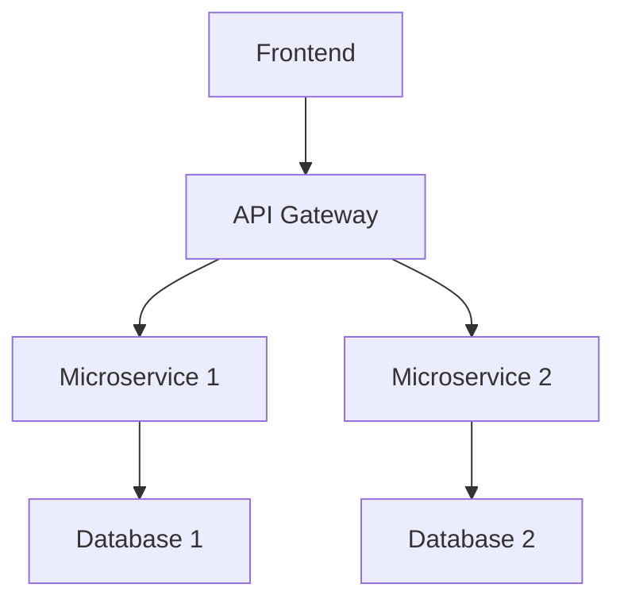

# Slidev Environment User Guide

**包括的なSlidever環境利用ガイド**

## 📋 目次

- [環境セットアップ](#環境セットアップ)
- [プレゼンテーション作成](#プレゼンテーション作成)
- [高度な機能](#高度な機能)
- [デプロイメント](#デプロイメント)
- [カスタマイズ](#カスタマイズ)

## 環境セットアップ

### 前提条件の確認

```bash
# Nixのインストール状況確認
which nix && nix --version

# direnvの確認
which direnv && direnv --version

# Gitの確認
git --version
```

### 初回セットアップ

1. **リポジトリクローン（既存の場合）**
   ```bash
   cd /path/to/dotfiles/slides
   ```

2. **Nix環境の有効化**
   ```bash
   # direnvで自動化（推奨）
   direnv allow
   
   # または手動でNix環境に入る
   nix develop
   ```

3. **環境確認**
   ```bash
   # 利用可能なツール確認
   node --version     # v22.16.0
   npm --version      # 10.9.2
   npx slidev --help  # Slidev CLI
   ```

## プレゼンテーション作成

### Step 1: 新規プロジェクト作成

```bash
# 新しいプレゼンテーション作成
nix run .#new -- my-presentation

# 作成されるファイル
# my-presentation/
# ├── .envrc          # 自動環境設定
# ├── slides.md       # メインコンテンツ
# └── package.json    # 依存関係（自動生成）
```

### Step 2: 環境セットアップ

```bash
cd my-presentation

# direnv環境を有効化
direnv allow

# 依存関係の確認（自動インストール済み）
npm list @slidev/cli
```

### Step 3: コンテンツ編集

#### 基本的なslides.md構造

```markdown
---
# フロントマター（設定）
theme: seriph
background: https://source.unsplash.com/1920x1080/?technology
title: My Awesome Presentation
info: |
  ## My Awesome Presentation
  
  Detailed description here
class: text-center
highlighter: shiki
lineNumbers: true
drawings:
  enabled: true
  persist: false
transition: slide-left
css: unocss
---

# タイトルスライド

サブタイトルや説明

<div class="pt-12">
  <span @click="$slidev.nav.next" class="px-2 py-1 rounded cursor-pointer" hover="bg-white bg-opacity-10">
    Press Space for next page <carbon:arrow-right class="inline"/>
  </span>
</div>

---

# 通常のスライド

- 箇条書き項目
- **太字テキスト**
- *斜体テキスト*
- `インラインコード`

## サブセクション

テキストコンテンツ

---

# コードブロック付きスライド

```typescript
// TypeScript例
interface User {
  name: string;
  age: number;
}

const user: User = {
  name: "Alice",
  age: 30
};
```

---

# アニメーション付きスライド

<v-clicks>

- 最初に表示される項目
- 次にクリックで表示
- 最後に表示

</v-clicks>

<v-click>

### サブセクションもアニメーション可能

</v-click>
```

### Step 4: ライブプレビュー

```bash
# 開発サーバー起動
npm run dev

# ブラウザで以下にアクセス
# http://localhost:3030
```

#### プレビューの機能

- **ライブリロード**: ファイル保存で自動更新
- **プレゼンターモード**: ノート表示
- **ドローイング**: マウスで図形描画
- **レコーディング**: 画面録画機能

### Step 5: 出力とエクスポート

```bash
# PDF出力
npm run export

# 静的サイト生成
npm run build

# カスタム出力
npx slidev export --output custom-name.pdf
npx slidev export --format png --output slides/
```

## 高度な機能

### Vue.jsコンポーネントの利用

```markdown
# Vue.jsコンポーネント

<div v-click="1" class="text-center">
  <h2>{{ message }}</h2>
  <button @click="count++" class="btn">
    Count: {{ count }}
  </button>
</div>

<script setup>
import { ref } from 'vue'

const message = ref('Hello Slidev!')
const count = ref(0)
</script>

<style>
.btn {
  @apply px-4 py-2 bg-blue-500 text-white rounded hover:bg-blue-600;
}
</style>
```

### Mermaid図表の統合

```markdown
# アーキテクチャ図



### LaTeX数式サポート

```markdown
# 数式スライド

インライン数式: $E = mc^2$

ブロック数式:
$$
\int_{-\infty}^{\infty} e^{-x^2} dx = \sqrt{\pi}
$$
```

### カスタムレイアウト

```markdown
---
layout: center
class: text-center
---

# センター配置スライド

---
layout: image-right
image: https://source.unsplash.com/1920x1080/?nature
---

# 右画像レイアウト

左側にコンテンツ、右側に画像
```

## デプロイメント

### 静的サイトホスティング

```bash
# ビルド
npm run build

# Netlify Deploy
npx netlify-cli deploy --dir=dist --prod

# Vercel Deploy  
npx vercel --prod ./dist

# Surge.sh Deploy
npx surge ./dist my-presentation.surge.sh

# GitHub Pages Deploy
npx gh-pages -d dist
```

### PDF共有

```bash
# PDF生成
npm run export

# クラウドストレージにアップロード
# Google Drive, Dropbox, OneDrive等
```

### Live Sharing

```bash
# 開発サーバーを外部公開
npm run dev -- --host 0.0.0.0

# ngrokでトンネリング
npx ngrok http 3030
```

## カスタマイズ

### カスタムテーマの作成

1. **テーマディレクトリ作成**
   ```bash
   mkdir -p theme
   cd theme
   ```

2. **テーマファイル作成**
   ```typescript
   // theme/index.ts
   import { Theme } from '@slidev/types'

   export default {
     name: 'my-custom-theme',
     colors: {
       primary: '#3b82f6',
       secondary: '#8b5cf6',
     },
     fontFamily: {
       sans: ['Inter', 'sans-serif'],
       mono: ['Fira Code', 'monospace'],
     },
   } as Theme
   ```

3. **CSSスタイル**
   ```css
   /* theme/styles/index.css */
   :root {
     --slidev-theme-primary: #3b82f6;
     --slidev-theme-secondary: #8b5cf6;
   }

   .slidev-layout {
     background: linear-gradient(45deg, #f0f9ff, #eff6ff);
   }
   ```

### プラグインの追加

```typescript
// vite.config.ts
import { defineConfig } from 'vite'

export default defineConfig({
  slidev: {
    addons: [
      '@slidev/addon-qrcode',
      '@slidev/addon-camera',
      'slidev-addon-rabbit'
    ]
  }
})
```

### ショートカットのカスタマイズ

```markdown
---
shortcuts:
  next: space
  prev: shift+space
  goto: g
---
```

## 開発ワークフロー

### 推奨ディレクトリ構造

```
my-presentation/
├── .envrc                 # Nix環境設定
├── slides.md              # メインコンテンツ
├── package.json           # 依存関係
├── public/                # 静的ファイル
│   ├── images/           # 画像リソース
│   └── videos/           # 動画ファイル
├── components/           # カスタムVueコンポーネント
├── layouts/              # カスタムレイアウト
└── styles/               # カスタムCSS
```

### 素材管理

```bash
# 画像の最適化
nix develop -c magick convert image.png -resize 1920x1080 optimized.png

# 動画の圧縮
nix develop -c ffmpeg -i video.mov -c:v libx264 -crf 23 compressed.mp4
```

### バージョン管理

```bash
# Gitで管理（推奨）
git init
git add .
git commit -m "Initial presentation"

# GitHub/GitLabで共有
git remote add origin https://github.com/username/my-presentation.git
git push -u origin main
```

## パフォーマンス最適化

### 画像の最適化

```markdown
# レスポンシブ画像


# 背景画像
---
background: /images/background.jpg
backgroundSize: cover
---
```

### 遅延読み込み

```markdown
<v-click>
  
</v-click>
```

### コード分割

```typescript
// 大きなコンポーネントの遅延読み込み
const HeavyChart = defineAsyncComponent(() => import('./HeavyChart.vue'))
```

## トラブルシューティング

### 一般的な問題と解決策

**問題: スライドが表示されない**
```bash
# キャッシュクリア
rm -rf node_modules/.cache
npm run dev
```

**問題: テーマが適用されない**
```bash
# テーマの再インストール
npm install @slidev/theme-[theme-name] --force
```

**問題: PDF出力でレイアウトが崩れる**
```bash
# Playwright ブラウザの更新
npx playwright install chromium
```

**問題: 開発サーバーが起動しない**
```bash
# ポート確認と変更
npm run dev -- --port 3031
```

### デバッグ方法

```bash
# 詳細ログの有効化
DEBUG=slidev* npm run dev

# Viteの開発者ツール
npm run dev -- --debug

# Node.jsデバッグモード
node --inspect node_modules/.bin/slidev dev
```

---

## 📚 次のステップ

- [TROUBLESHOOTING.md](TROUBLESHOOTING.md) - より詳細なトラブルシューティング
- [BEST_PRACTICES.md](BEST_PRACTICES.md) - ベストプラクティス集
- [TEMPLATES.md](TEMPLATES.md) - 使いやすいテンプレート集

---

*🤖 Generated with [Claude Code](https://claude.ai/code)*