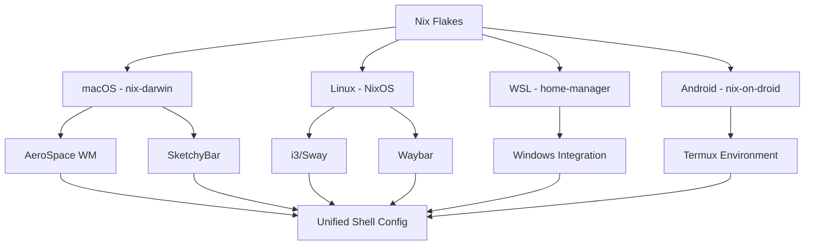

# Modern Dotfiles Management

Cross-Platform Development Environment with **Nix**

<div class="pt-12">
  <span @click="$slidev.nav.next" class="px-2 py-1 rounded cursor-pointer" hover="bg-white bg-opacity-10">
    Press Space for next page <carbon:arrow-right class="inline"/>
  </span>
</div>

<div class="abs-br m-6 flex gap-2">
  <button @click="$slidev.nav.openInEditor()" title="Open in Editor" class="text-xl icon-btn opacity-50 !border-none !hover:text-white">
    <carbon:edit />
  </button>
  <a href="https://github.com/gapul/dotfiles" target="_blank" alt="GitHub"
    class="text-xl icon-btn opacity-50 !border-none !hover:text-white">
    <carbon:logo-github />
  </a>
</div>

---
transition: fade-out
---

# What are Dotfiles?

Dotfiles are **configuration files** that customize your development environment

<v-clicks>

- 🏠 **Personal Setup**: Shell configurations, editor settings, aliases
- 🔧 **Tool Configuration**: Git, terminal, development tools
- 🎨 **Customization**: Themes, shortcuts, productivity enhancements
- 🚀 **Automation**: Scripts, workflows, environment setup
- 📦 **Package Management**: Software installation and updates

</v-clicks>

<br>
<br>

<v-click>

## The Challenge

- Multiple machines (work, personal, servers)
- Different operating systems (macOS, Linux, WSL)
- Keeping configurations in sync
- Reproducible development environments

</v-click>

---

# Why Nix for Dotfiles?

Nix provides **declarative**, **reproducible**, and **reliable** system management

<div grid="~ cols-2 gap-4">
<div>

## 🎯 Traditional Approach
```bash
# Install packages manually
brew install git neovim
apt install git neovim

# Configuration scattered
~/.gitconfig
~/.vimrc
~/.zshrc
~/.config/...

# Manual synchronization
# Version conflicts
# Platform differences
```

</div>
<div>

## ✨ Nix Approach
```nix
{
  programs.git.enable = true;
  programs.neovim.enable = true;
  
  home.packages = with pkgs; [
    git neovim tmux
  ];
}
```

- **Declarative**: Describe what you want
- **Reproducible**: Same result every time
- **Atomic**: All-or-nothing updates
- **Rollback**: Easy to undo changes

</div>
</div>

---

# Our Multi-Platform Architecture

Supporting **4 platforms** with unified configuration



---
layout: center
class: text-center
---

# Project Structure Overview

<div class="text-left">

```
dotfiles/
├── nix/platforms/
│   ├── flake.nix                    # Main entry point
│   ├── common/
│   │   ├── platform-detection.nix  # Auto-detect platform
│   │   ├── packages/core.nix       # Essential tools
│   │   ├── themes/colors.nix       # Unified theming
│   │   └── development/default.nix # Dev environment
│   ├── darwin/                     # macOS specific
│   ├── linux/                      # Linux specific
│   ├── wsl/                        # WSL integration
│   └── android/                    # Termux support
├── configs/
│   ├── shell/                      # Zsh, aliases, functions
│   ├── terminal/wezterm.lua        # Terminal config
│   ├── wm/aerospace/               # Window manager
│   └── editors/neovim/             # Editor setup
└── scripts/                       # Automation tools
```

</div>

---

# Key Features & Capabilities

<div grid="~ cols-2 gap-8">
<div>

## 🔧 Development Environment
- **LSP Integration**: Language servers for 15+ languages
- **AI Tools**: GitHub Copilot, ChatGPT integration
- **Container Support**: Docker, Podman, Kubernetes
- **Modern CLI Tools**: ripgrep, fd, bat, exa, fzf

## 🛡️ Security & Secrets
- **SOPS-nix**: Encrypted secrets management
- **Git-crypt**: Selective file encryption
- **SSH Key Management**: Automated key generation
- **Secure Defaults**: Hardened configurations

</div>
<div>

## 🚀 Automation & CI/CD
- **GitHub Actions**: Multi-platform testing
- **Infrastructure as Code**: Terraform, Ansible
- **Health Monitoring**: System diagnostics
- **Auto-deployment**: Production pipelines

## 📊 Monitoring & Analytics
- **Performance Metrics**: Resource monitoring
- **Usage Analytics**: Tool usage patterns
- **Health Checks**: System validation
- **Reporting**: Automated status reports

</div>
</div>

---

# Live Demo: Package Management

Real-time package installation with Nix

<div class="grid grid-cols-2 gap-4">

<div>

## Traditional Package Management
```bash
# Different commands per platform
brew install htop        # macOS
apt install htop         # Ubuntu
pacman -S htop          # Arch
choco install htop      # Windows

# Version conflicts
# Dependency hell
# Manual updates
# No reproducibility
```

</div>

<div>

## Nix Declarative Approach
```nix
# Single configuration
home.packages = with pkgs; [
  htop
  neovim
  git
  docker
];

# ✅ Same version everywhere
# ✅ Automatic dependencies
# ✅ Atomic updates
# ✅ Easy rollbacks
```

</div>

</div>

<v-click>

## Quick Installation Commands

```bash
# Install on any platform
nix run .#setup

# Update everything
nix flake update && nix run .#rebuild

# Rollback if needed
nix run .#rollback
```

</v-click>

---

# Advanced Features Showcase

<div grid="~ cols-2 gap-6">
<div>

## 🤖 AI-Powered Development

```nix
{
  dotfiles.development = {
    enable = true;
    profile = "ai-powered";
    
    ai.tools = [
      "github-copilot"
      "chatgpt-cli"
      "aider-chat"
    ];
    
    languages = [
      "python" "rust" "go"
      "typescript" "nix"
    ];
  };
}
```

</div>
<div>

## 🏢 Enterprise Security

```nix
{
  dotfiles.security = {
    enterprise.enable = true;
    securityLevel = "high";
    
    encryption = {
      sops = true;
      git-crypt = true;
    };
    
    monitoring = {
      auditLogs = true;
      compliance = "soc2";
    };
  };
}
```

</div>
</div>

<br>

## 🌐 Universal Platform Support

```bash
# Platform detection
nix eval .#platformInfo --json | jq .platform
# → "darwin", "linux", "wsl", "android"

# Automatic adaptation
nix run .#detect-platform
```

---

# Real-World Benefits

<v-clicks>

## 📈 **Productivity Gains**
- **Setup Time**: New machine ready in 15 minutes
- **Consistency**: Identical environment across all devices  
- **No Configuration Drift**: Declarative prevents divergence

## 🔒 **Security Improvements**
- **Encrypted Secrets**: SOPS + age encryption
- **Audit Trail**: All changes tracked in Git
- **Compliance Ready**: SOC2 framework support

## 🚀 **Development Velocity**
- **Instant Dev Environments**: `nix develop` 
- **Language Support**: 15+ languages with LSP
- **Container Integration**: Docker/Podman ready

## 💰 **Cost Reduction**
- **Infrastructure as Code**: Terraform automation
- **Reduced Onboarding**: Self-service environment setup
- **Fewer Support Tickets**: Reproducible configurations

</v-clicks>

---
layout: center
class: text-center
---

# Getting Started

<div class="text-left mt-8">

## Quick Setup (Any Platform)

```bash
# 1. Clone the repository
git clone https://github.com/gapul/dotfiles.git
cd dotfiles

# 2. Run automated setup
nix run .#setup

# 3. Enjoy your new environment! 🎉
```

## Common Commands

```bash
nix run .#rebuild           # Apply configuration changes
nix run .#health           # System health check
nix run .#analyze          # System analysis
nix flake update           # Update all packages
```

</div>

<div class="mt-8">

[📚 Full Documentation](https://github.com/gapul/dotfiles) | [🚀 Live Demo](http://localhost:3030)

</div>

---
layout: center
class: text-center
---

# Thank You!

**Modern Dotfiles Management with Nix**

<div class="pt-12">
  <span class="px-2 py-1 rounded cursor-pointer text-lg">
    Questions & Discussion 💬
  </span>
</div>

<div class="abs-br m-6 flex gap-2 text-xl">
  <a href="https://github.com/gapul/dotfiles" target="_blank" alt="GitHub" class="icon-btn opacity-50 !border-none !hover:text-white">
    <carbon:logo-github />
  </a>
  <a href="https://twitter.com" target="_blank" alt="Twitter" class="icon-btn opacity-50 !border-none !hover:text-white">
    <carbon:logo-twitter />
  </a>
  <a href="mailto:92638132+gapul@users.noreply.github.com" target="_blank" alt="Email" class="icon-btn opacity-50 !border-none !hover:text-white">
    <carbon:email />
  </a>
</div>
