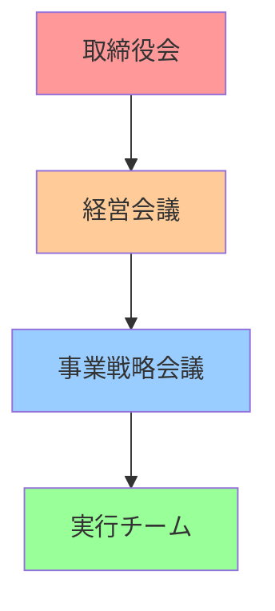

# ビジネスプレゼンテーション

**副題：戦略的提案**

<div class="pt-12">
  <span @click="$slidev.nav.next" class="px-2 py-1 rounded cursor-pointer" hover="bg-blue-100">
    プレゼンテーション開始 →
  </span>
</div>

<div class="abs-br m-6 text-xl">
  📊 2025年度 戦略計画
</div>

---
layout: center
---

# エグゼクティブサマリー

<div grid="~ cols-3 gap-8" class="mt-8">
<div class="text-center">

## 📈 成長機会
**市場拡大**

新領域への参入により
**年間売上30%増**を目指す

</div>
<div class="text-center">

## 💰 投資効果
**ROI 300%**

2年間で投資回収
3年目から本格収益

</div>
<div class="text-center">

## 🎯 競争優位
**差別化戦略**

独自技術と
顧客体験の革新

</div>
</div>

<v-click>

### 📋 本日の提案内容

現在の市場機会を捉え、戦略的投資により持続的成長を実現する包括的計画

</v-click>

---

# 市場環境分析

## 📊 マクロ環境

<div grid="~ cols-2 gap-8">
<div>

### 🌍 市場トレンド
- **デジタル化加速**: 前年比 **+45%**
- **リモートワーク**: 普及率 **85%**
- **AI・自動化**: 導入企業 **+60%**
- **サステナビリティ**: 重要度 **向上**

### 📈 市場規模
```
2023年: ¥1,200億
2024年: ¥1,450億 (+21%)
2025年: ¥1,740億 (+20%)
```

</div>
<div>

### 🎯 ターゲット市場

<div class="space-y-4">
<div class="p-4 bg-blue-50 rounded">

**プライマリー市場**
- 企業規模: 従業員100-1000名
- 業界: IT・金融・製造業
- 予算規模: ¥1000万-1億

</div>
<div class="p-4 bg-green-50 rounded">

**セカンダリー市場**  
- スタートアップ企業
- 地方自治体
- 教育機関

</div>
</div>

</div>
</div>

---

# 競合分析

## 🏆 競合ポジショニング

<div grid="~ cols-2 gap-8">
<div>

### 主要競合他社

| 企業 | 市場シェア | 強み | 弱み |
|------|----------|------|------|
| **A社** | 35% | ブランド力 | 高価格 |
| **B社** | 28% | 技術力 | サポート |
| **C社** | 15% | 低価格 | 機能制限 |
| **当社** | 8% | カスタマイズ | 認知度 |

</div>
<div>

### 💡 差別化戦略

<v-clicks>

- **🎯 特化型ソリューション**  
  業界特有のニーズに対応

- **🤝 パートナーシップ**  
  エコシステム構築

- **⚡ 迅速な導入支援**  
  3日で運用開始

- **📞 24/7サポート**  
  日本語での充実サポート

</v-clicks>

</div>
</div>

<v-click>

## 🎯 勝利の方程式

> **専門特化** × **迅速導入** × **充実サポート** = **顧客満足度95%以上**

</v-click>

---

# 事業戦略

## 🚀 3つの成長戦略

<v-clicks>

### 1️⃣ 市場浸透戦略
<div grid="~ cols-2 gap-4">
<div>

**既存市場での拡大**
- 営業力強化: +20名
- マーケティング投資: 2倍
- 顧客満足度向上施策

</div>
<div>

**目標**
- 市場シェア: 8% → **15%**
- 売上: ¥80億 → **¥150億**

</div>
</div>

### 2️⃣ 新市場開拓戦略
<div grid="~ cols-2 gap-4">
<div>

**新たな顧客セグメント**
- 中小企業向けパッケージ
- 海外市場への展開
- 新業界への参入

</div>
<div>

**目標**  
- 新規顧客: **1,000社**
- 海外売上比率: **20%**

</div>
</div>

### 3️⃣ 新規事業戦略
- AI・機械学習サービス
- SaaS プラットフォーム
- コンサルティング事業

</v-clicks>

---

# 実行計画

## 📅 ロードマップ (24ヶ月)

<div class="timeline">

<v-clicks>

### Phase 1: 基盤強化 (0-6ヶ月)
- 組織体制整備
- システム基盤構築  
- 人材採用・教育
- **投資額**: ¥5億

### Phase 2: 市場参入 (6-12ヶ月)
- 新サービスローンチ
- マーケティング展開
- パートナーシップ構築
- **投資額**: ¥8億

### Phase 3: スケール拡大 (12-18ヶ月)
- 海外展開開始
- サービス拡充
- 運営効率化
- **投資額**: ¥6億

### Phase 4: 収益最大化 (18-24ヶ月)
- 事業統合・最適化
- 新技術導入
- M&A検討
- **投資額**: ¥3億

</v-clicks>

</div>

<style>
.timeline {
  position: relative;
  padding-left: 2rem;
}
.timeline::before {
  content: '';
  position: absolute;
  left: 0.5rem;
  top: 0;
  height: 100%;
  width: 2px;
  background: #3b82f6;
}
</style>

---

# 財務計画

## 💰 投資計画と収益予測

<div grid="~ cols-2 gap-8">
<div>

### 📊 投資内訳 (3年間)

```
人件費:     ¥12億 (55%)
技術開発:   ¥5億  (23%)
マーケ:     ¥3億  (14%)
設備・その他: ¥2億  (8%)
─────────────────
総投資額:   ¥22億
```

### 💡 資金調達計画
- **自己資本**: ¥10億
- **銀行融資**: ¥8億  
- **投資家**: ¥4億

</div>
<div>

### 📈 売上・利益予測

| 年度 | 売上 | 営業利益 | 利益率 |
|------|------|----------|--------|
| 2025 | ¥95億 | ¥8億 | 8.4% |
| 2026 | ¥145億 | ¥20億 | 13.8% |
| 2027 | ¥210億 | ¥40億 | 19.0% |

### 🎯 ROI分析
- **投資回収期間**: 2.2年
- **3年累計ROI**: **295%**
- **IRR**: **45%**

</div>
</div>

<v-click>

## 💎 バリュエーション

現在の企業価値 **¥180億** → 3年後予想 **¥850億** (**4.7倍成長**)

</v-click>

---

# リスク分析と対策

## ⚠️ 主要リスクと対応策

<v-clicks>

### 🏢 事業リスク
<div grid="~ cols-2 gap-4">
<div>

**リスク要因**
- 競合他社の追随
- 技術革新の遅れ
- 人材確保の困難

</div>
<div>

**対応策**
- 特許・商標の積極取得
- R&D投資の継続強化
- 魅力的な労働環境整備

</div>
</div>

### 💹 市場リスク
<div grid="~ cols-2 gap-4">
<div>

**リスク要因**
- 景気後退
- 規制変更
- 為替変動

</div>
<div>

**対応策**  
- 事業ポートフォリオ分散
- 法的コンプライアンス強化
- ヘッジ戦略の実施

</div>
</div>

### 🔧 運営リスク
- システム障害対策
- 品質管理体制
- 情報セキュリティ

</v-clicks>

<v-click>

## 📊 リスクマトリクス

| リスク | 発生確率 | 影響度 | 重要度 | 対策状況 |
|--------|----------|--------|--------|----------|
| 競合参入 | 中 | 高 | **高** | ✅ 対策済 |
| 人材不足 | 高 | 中 | **高** | 🔄 実施中 |
| 技術変化 | 中 | 中 | 中 | ✅ 対策済 |

</v-click>

---

# 実施体制

## 👥 プロジェクト体制

<div grid="~ cols-2 gap-8">
<div>

### 🎯 実行責任者

**プロジェクト統括**
- CEO: 全体戦略・意思決定
- COO: 実行管理・進捗確認

**事業責任者**
- 事業部長: P&L責任
- マーケティング部長: 顧客獲得
- 技術部長: 製品開発

</div>
<div>

### 📋 ガバナンス体制

**意思決定プロセス**


**レポートライン**
- 月次: 事業KPI報告
- 四半期: 戦略レビュー
- 年次: 計画見直し

</div>
</div>

---

# KPI と測定指標

## 📊 成功指標の設定

<v-clicks>

### 🎯 財務KPI
| 指標 | 現在 | 1年後目標 | 3年後目標 |
|------|------|-----------|-----------|
| 売上高 | ¥80億 | ¥145億 | ¥210億 |
| 営業利益率 | 5.2% | 13.8% | 19.0% |
| 市場シェア | 8% | 12% | 18% |

### 📈 事業KPI  
- **顧客満足度**: 95%以上維持
- **従業員満足度**: 90%以上
- **新規顧客獲得**: 月50社
- **顧客継続率**: 95%以上

### 🔧 運営KPI
- **システム稼働率**: 99.9%
- **問い合わせ対応**: 24時間以内
- **製品リリース**: 月次更新

</v-clicks>

<v-click>

## 📱 ダッシュボード

リアルタイム業績モニタリングシステムで全KPIを可視化・追跡

</v-click>

---
layout: center
class: text-center
---

# 提案のまとめ

<v-clicks>

## ✅ なぜこの提案なのか

- **市場機会**: 拡大する¥1,740億市場
- **競争優位**: 独自の差別化戦略  
- **収益性**: ROI 295%の高い投資効果
- **実現性**: 詳細な計画と体制

## 🚀 期待される成果

> **3年で企業価値4.7倍成長を実現し、業界リーダーポジションを確立**

</v-clicks>

<div class="pt-12">
  <span class="text-xl font-bold text-blue-600">
    ご質問・ご意見をお聞かせください 💬
  </span>
</div>

---

# Next Steps

## 📅 今後のアクション

<v-clicks>

### 🔄 即座に実行 (1週間以内)
- [ ] 取締役会での承認取得
- [ ] 実行チーム組成
- [ ] 詳細計画の策定

### 📋 短期実行 (1ヶ月以内)  
- [ ] 予算確保・資金調達
- [ ] 人材採用開始
- [ ] システム開発着手

### 🎯 中期実行 (3ヶ月以内)
- [ ] 新サービス開発完了
- [ ] マーケティング施策実行
- [ ] パートナーシップ締結

</v-clicks>

<v-click>

## 📞 お問い合わせ

**プロジェクト責任者**: 田中部長  
**Email**: tanaka@company.com  
**Phone**: 03-1234-5678

</v-click>

---

# Appendix

追加情報・詳細資料

## 📊 詳細財務シミュレーション

```
シナリオ分析:
楽観的: ROI 380% (市場成長率+30%)
基本:   ROI 295% (計画通り)  
悲観的: ROI 180% (市場成長率-20%)
```

## 🔍 市場調査データ

- **調査期間**: 2024年10-12月
- **対象**: 企業500社、個人1,000名
- **調査機関**: ○○総研
- **信頼区間**: 95%

## 📚 参考資料

- [市場調査レポート](https://internal.docs/market-research)
- [競合分析詳細](https://internal.docs/competitive-analysis)  
- [技術仕様書](https://internal.docs/tech-specs)
- [財務モデル](https://internal.docs/financial-model)

---

<!--
このテンプレートの使用方法:

1. 業界・事業特性に合わせてカスタマイズ
   - 市場データ、競合情報
   - 財務数値、KPI指標
   - リスク要因、対策

2. オーディエンス別の調整
   - 投資家向け: ROI、リスクを重視
   - 経営陣向け: 戦略、実行可能性
   - 従業員向け: ビジョン、成長機会

3. プレゼン時間に応じた調整
   - 15分: エッセンスを抽出
   - 30分: 標準構成
   - 60分: 詳細分析を追加

4. インタラクティブ要素
   - 質疑応答時間の確保
   - ワークショップ形式
   - フィードバック収集
-->

*📊 Business Presentation Template - Created with Slidev*