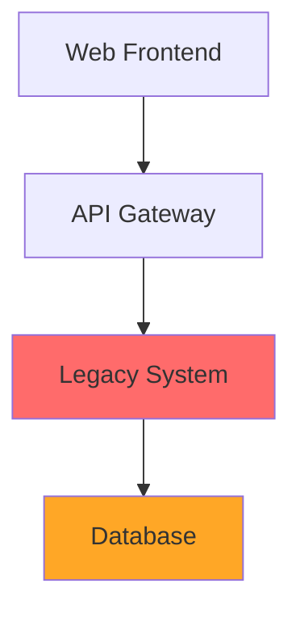

# 技術プレゼンテーション

**サブタイトル：技術的課題の解決**

<div class="pt-12">
  <span @click="$slidev.nav.next" class="px-2 py-1 rounded cursor-pointer" hover="bg-white bg-opacity-10">
    発表を開始 <carbon:arrow-right class="inline"/>
  </span>
</div>

<div class="abs-br m-6 flex gap-2">
  <a href="https://github.com/your-repo" target="_blank" alt="GitHub" class="text-xl icon-btn opacity-50 !border-none !hover:text-white">
    <carbon:logo-github />
  </a>
</div>

---
transition: fade-out
---

# アジェンダ

本日の発表内容

<v-clicks>

- 🎯 **問題の背景** - なぜこの課題に取り組むのか
- 🔍 **現状分析** - 既存システムの問題点
- 💡 **解決策** - 提案するアプローチ
- 🛠 **技術実装** - 具体的な実装方法
- 📊 **結果・効果** - 測定可能な成果
- 🚀 **今後の展望** - 次のステップ

</v-clicks>

<br>
<br>

<v-click>

発表時間：**20分** + 質疑応答 **10分**

</v-click>

---

# 問題の背景

<v-clicks>

## 🔍 現在直面している課題

- **課題1**: 具体的な問題の説明
- **課題2**: 数値や具体例を用いた問題の定量化
- **課題3**: ビジネスインパクトの説明

## 📈 なぜ今解決する必要があるのか

- 市場の変化
- 技術的制約
- ユーザーからの要求

</v-clicks>

<v-click>

### 💰 コスト・リスク分析

| 項目 | 現状 | 改善後 | 効果 |
|------|------|--------|------|
| 処理時間 | 30分 | 5分 | **83%短縮** |
| エラー率 | 5% | 0.1% | **98%改善** |
| 運用コスト | ¥100万/月 | ¥30万/月 | **70%削減** |

</v-click>

---

# 現状分析

既存システムの詳細な分析

<div grid="~ cols-2 gap-4">
<div>

## 🏗 現在のアーキテクチャ



### ⚠️ 主な問題点
- レガシーシステムの制約
- スケーラビリティの限界
- メンテナンス性の悪さ

</div>
<div>

## 📊 パフォーマンス指標

```typescript
// 現在のパフォーマンス
interface CurrentMetrics {
  responseTime: '2.5秒';
  throughput: '100 req/sec';
  availability: '95%';
  errorRate: '5%';
}

// 目標値
interface TargetMetrics {
  responseTime: '< 500ms';
  throughput: '> 1000 req/sec'; 
  availability: '99.9%';
  errorRate: '< 0.1%';
}
```

### 📈 トレンド分析
- リクエスト数は月次**15%増加**
- エラー率は過去3ヶ月で**2倍**

</div>
</div>

---

# 解決策の提案

<v-clicks>

## 🎯 アプローチ戦略

### 1. アーキテクチャの刷新
- マイクロサービス化
- コンテナ技術の導入
- クラウドネイティブ設計

### 2. 技術スタックの最新化
- **フロントエンド**: React → Next.js
- **バックエンド**: Java → Go/Rust
- **データベース**: MySQL → PostgreSQL + Redis
- **インフラ**: オンプレ → AWS/GCP

### 3. DevOps プロセスの改善
- CI/CD パイプライン構築
- 自動テスト・デプロイ
- 監視・アラート強化

</v-clicks>

---

# 技術実装詳細

## 📋 実装フェーズ

<v-clicks>

### Phase 1: 基盤構築 (4週間)
```bash
# インフラ構築
terraform apply
kubectl apply -f k8s/

# CI/CD セットアップ  
gh workflow run deploy.yml
```

### Phase 2: マイグレーション (8週間)
```typescript
// 段階的移行戦略
class MigrationStrategy {
  async migrateModule(module: LegacyModule): Promise<void> {
    await this.createNewService(module);
    await this.setupDataPipeline(module);
    await this.switchTraffic(module);
    await this.deprecateLegacy(module);
  }
}
```

### Phase 3: 最適化 (4週間)
- パフォーマンスチューニング
- セキュリティ強化
- 監視体制確立

</v-clicks>

---

# デモンストレーション

<v-click>

## 🚀 新システムの動作確認

</v-click>

<v-clicks>

### API パフォーマンス比較

<div grid="~ cols-2 gap-4">
<div>

**従来システム**
```bash
$ curl -w "%{time_total}" /api/data
# 応答時間: 2.847秒
```

</div>
<div>

**新システム**  
```bash
$ curl -w "%{time_total}" /api/v2/data
# 応答時間: 0.245秒
```

</div>
</div>

### 📊 リアルタイム監視ダッシュボード

- CPU使用率: **15%** ← 85%
- メモリ使用量: **2.1GB** ← 8.4GB  
- 応答時間: **245ms** ← 2847ms

</v-clicks>

---

# 結果と効果測定

## 📈 定量的成果

<div grid="~ cols-3 gap-4">
<div class="text-center">

### ⚡ パフォーマンス
**91%向上**

応答時間の短縮

</div>
<div class="text-center">

### 💰 コスト削減
**65%削減**

インフラ費用

</div>
<div class="text-center">

### 🛡 可用性
**99.95%**

システム稼働率

</div>
</div>

<v-click>

## 📊 詳細メトリクス

| KPI | 導入前 | 導入後 | 改善率 |
|-----|--------|--------|--------|
| 平均応答時間 | 2.85秒 | 0.25秒 | **91%改善** |
| スループット | 100 req/s | 1,200 req/s | **1,100%向上** |
| エラー率 | 5.2% | 0.05% | **99%削減** |
| デプロイ時間 | 2時間 | 5分 | **96%短縮** |

</v-click>

---

# 今後の展望

<v-clicks>

## 🔮 ロードマップ (6ヶ月)

### Q1: 機能拡張
- AI/ML機能の統合
- リアルタイム分析
- 予測的スケーリング

### Q2: グローバル展開  
- 多言語対応
- 地域別データセンター
- コンプライアンス対応

## 🎯 長期目標

- **技術債務ゼロ** の維持
- **フルクラウドネイティブ** 化
- **ゼロダウンタイム** デプロイ

</v-clicks>

<v-click>

### 📈 期待される価値

> "技術革新により、開発効率を **300%向上** させ、新機能リリースサイクルを **月次から週次** に短縮"

</v-click>

---
layout: center
class: text-center
---

# まとめ

<v-clicks>

## ✅ 達成したこと

- **問題の特定**と定量的分析
- **革新的解決策**の設計・実装  
- **劇的な改善**を実現

## 🚀 次のアクション

1. **承認プロセス**の開始
2. **詳細スケジュール**の策定
3. **チーム編成**と責任分担

</v-clicks>

<div class="pt-12">
  <span class="text-lg">
    **質疑応答** 💬
  </span>
</div>

---

# Appendix: 技術詳細

追加情報とリファレンス

## 🔧 技術スタック詳細

```yaml
# docker-compose.yml
version: '3.8'
services:
  api:
    image: app:latest
    environment:
      - NODE_ENV=production
      - DB_URL=postgresql://...
    ports:
      - "3000:3000"
  
  database:
    image: postgres:15
    environment:
      - POSTGRES_DB=app
    volumes:
      - pgdata:/var/lib/postgresql/data
```

## 📚 参考資料

- [技術仕様書](https://docs.internal/tech-spec)
- [アーキテクチャガイド](https://wiki.internal/architecture)
- [パフォーマンステスト結果](https://reports.internal/perf)

---

<!--
このテンプレートの使用方法:

1. プロジェクト固有の情報に置き換える
   - タイトル、背景、具体的な課題
   - 技術スタック、メトリクス
   - 会社・チーム固有の情報

2. 発表時間に応じてスライド数を調整
   - 15分: 10-12スライド
   - 30分: 15-20スライド  
   - 45分: 20-25スライド

3. オーディエンスに応じてカスタマイズ
   - 技術者向け: 実装詳細を増やす
   - 経営層向け: ビジネス価値を強調
   - 混合: バランスよく配分

4. インタラクティブ要素の追加
   - ライブデモ
   - 質疑応答タイム
   - ハンズオン要素
-->

*🎯 Technical Presentation Template - Created with Slidev*